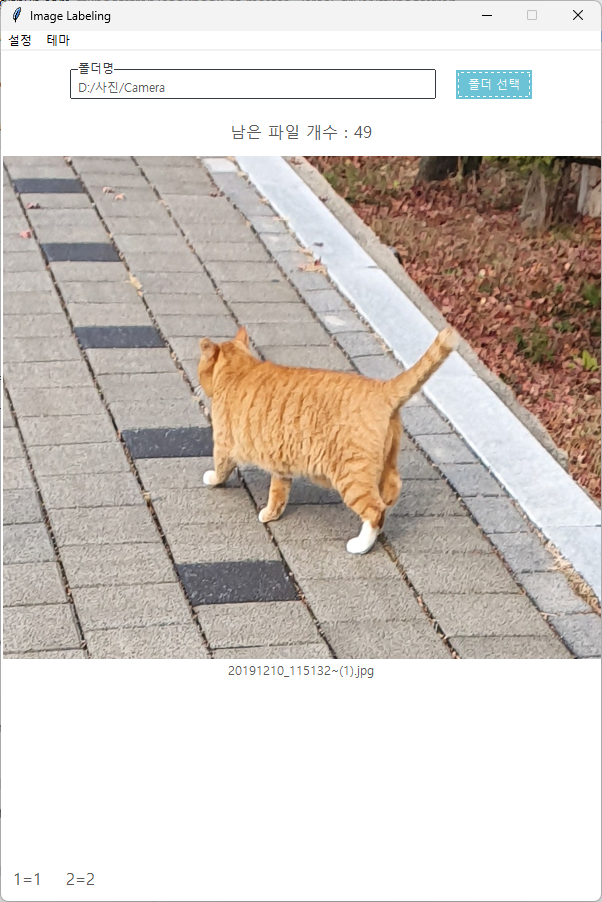
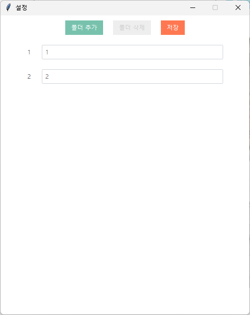

# 이미지 라벨링(파일 이동) 프로그램
이미지를 확인하면서 설정해둔 하위 폴더로 이동시키는 프로그램.
jpg, jpeg, png, gif, webp 파일 형태를 읽으며, gif와 webp의 경우 움짤이 재생되지는 않음.

## 사용 방법

- [폴더 선택] 버튼을 눌러 분류할 이미지들이 있는 폴더를 지정한다.
  - 해당 폴더의 이미지 수와 분류 대상 이미지 1개가 표시된다.
- 프로그램 하단에서 단축키에 해당하는 폴더명을 확인할 수 있다.
- 숫자키 0~9를 눌러 설정해둔 하위 폴더로 이동시킨다.
  - 이미 동일한 파일명을 가진 이미지가 있는 경우, 랜덤 값을 파일명에 추가하여 이동시킨다.
- 좌우 방향키를 눌러 이미지를 탐색할 수 있다.
- Delete키를 누르면 이미지를 삭제할 수 있다.
- 테마 메뉴에서 라이트 모드, 다크 모드를 선택할 수 있다.
- 설정 메뉴에서 각 숫자 단축키에 해당하는 폴더명을 지정한다.

- 지정할 수 있는 폴더 수는 최소 2개, 최대 10개로 폴더 추가와 삭제 버튼으로 조절할 수 있다.
- 저장 버튼을 눌러야 적용이 된다.